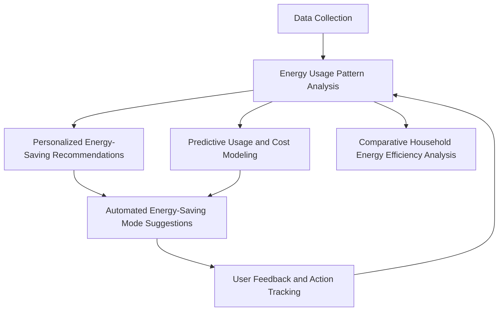
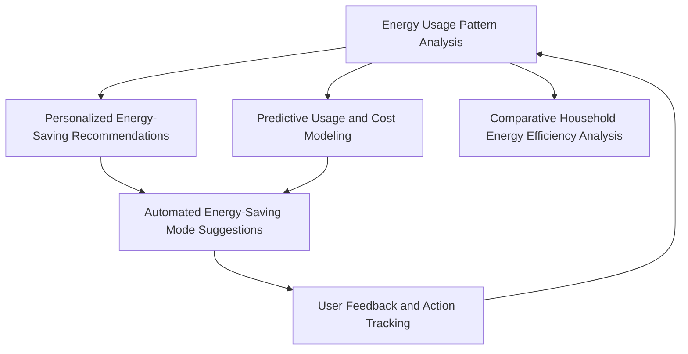

# Smart Home Energy Management System Analysis

## 1. System Overview

The Smart Home Energy Management System uses LLMs to analyze energy usage patterns, provide personalized recommendations, and optimize energy consumption in residential settings. The system aims to reduce energy costs and improve efficiency without direct control of smart home devices.

## 2. Sub-processes

1. Energy Usage Pattern Analysis
2. Personalized Energy-Saving Recommendations
3. Predictive Usage and Cost Modeling
4. Automated Energy-Saving Mode Suggestions
5. Comparative Household Energy Efficiency Analysis

## 3. Detailed Sub-process Analysis

### 3.1 Energy Usage Pattern Analysis

#### Input Schema
```json
{
  "household_id": "string",
  "energy_consumption_data": [
    {
      "timestamp": "datetime",
      "energy_used": "number",
      "device_category": "string"
    }
  ],
  "household_info": {
    "size_sqft": "number",
    "num_occupants": "number",
    "location": {
      "city": "string",
      "climate_zone": "string"
    }
  },
  "weather_data": [
    {
      "date": "date",
      "average_temperature": "number",
      "humidity": "number"
    }
  ]
}
```

#### Output Schema
```json
{
  "household_id": "string",
  "usage_patterns": [
    {
      "pattern_type": "string",
      "description": "string",
      "average_daily_consumption": "number",
      "peak_usage_times": ["string"],
      "major_contributors": ["string"]
    }
  ],
  "anomalies": [
    {
      "date": "date",
      "description": "string",
      "excess_consumption": "number"
    }
  ],
  "efficiency_score": "number"
}
```

### 3.2 Personalized Energy-Saving Recommendations

#### Input Schema
```json
{
  "household_id": "string",
  "usage_patterns": [
    {
      "pattern_type": "string",
      "description": "string",
      "average_daily_consumption": "number",
      "peak_usage_times": ["string"],
      "major_contributors": ["string"]
    }
  ],
  "household_preferences": {
    "comfort_level": "number",
    "eco_consciousness": "number",
    "budget_sensitivity": "number"
  },
  "current_energy_costs": {
    "average_monthly_bill": "number",
    "energy_rate": "number"
  }
}
```

#### Output Schema
```json
{
  "household_id": "string",
  "recommendations": [
    {
      "category": "string",
      "description": "string",
      "estimated_savings": "number",
      "effort_level": "string",
      "priority": "number"
    }
  ],
  "personalized_message": "string",
  "potential_annual_savings": "number"
}
```

## 4. Process Flow



## 5. Component Relationship Diagram



## 6. Pros and Cons Analysis

| Aspect | Pros | Cons |
|--------|------|------|
| LLM Modeling | - Natural language processing for user-friendly insights<br>- Generation of personalized recommendations<br>- Adaptive communication based on user preferences | - Limitation in processing raw numerical data<br>- Potential for misinterpreting complex energy patterns<br>- Lack of direct control over smart home devices |
| Economic Modeling | - Clear energy savings metrics<br>- Potential for significant cost reduction<br>- Improved user engagement with energy management | - Difficulty in attributing savings to specific recommendations<br>- Variability in energy prices and usage patterns<br>- Complexity in measuring long-term behavior changes |

## 7. Key Performance Indicators (KPIs)

1. Percentage Reduction in Energy Consumption
2. Average Monthly Cost Savings
3. User Engagement Rate with Recommendations
4. Accuracy of Energy Usage Predictions
5. Improvement in Household Energy Efficiency Score
6. User Satisfaction Rating

## 8. Economic Impact Model

Let:
- E = Energy consumption reduction (kWh)
- R = Energy rate ($/kWh)
- A = Adoption rate of recommendations
- S = Seasonal factor
- C = Cost of system implementation and maintenance

Then, the Annual Economic Impact (AEI) can be modeled as:

AEI = (E * R * A * S * 12 months) - C

This model accounts for the energy savings, considering the adoption rate of recommendations and seasonal variations, while factoring in the cost of the system. The actual model would likely be more complex, potentially including factors such as peak demand reduction and long-term efficiency improvements.

</antA