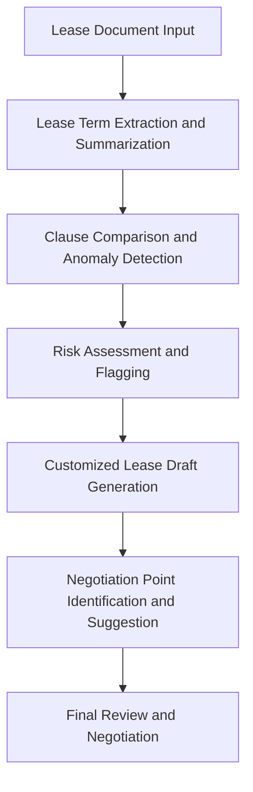
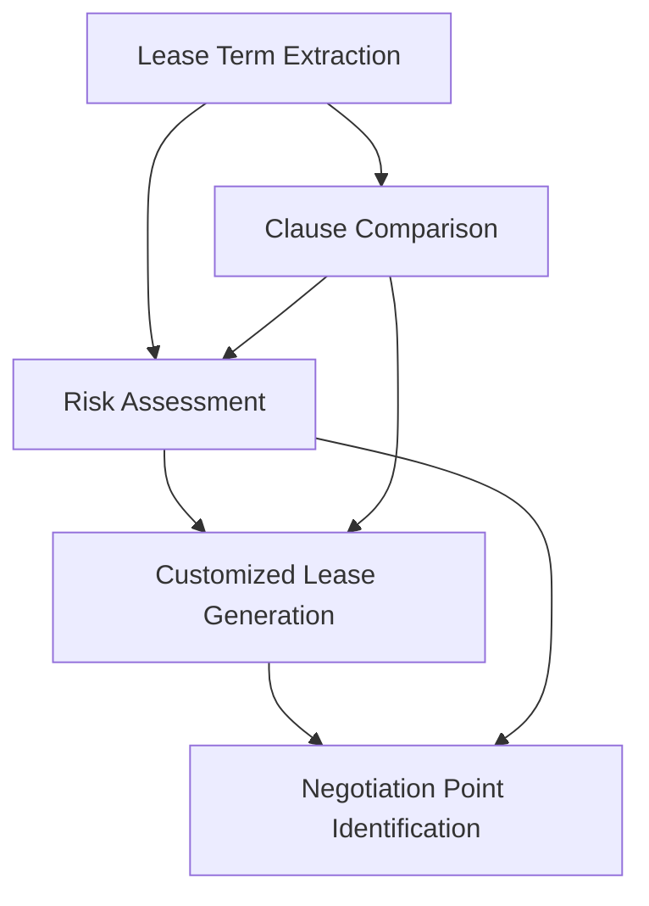

# Legal Document Analysis and Contract Generation System Analysis (Commercial Lease Agreements)

## 1. System Overview

This system utilizes LLMs to analyze commercial lease agreements, extract key information, assess risks, and generate customized lease drafts. It aims to streamline the lease review and creation process while improving accuracy and consistency.

## 2. Sub-processes

1. Lease Term Extraction and Summarization
2. Clause Comparison and Anomaly Detection
3. Risk Assessment and Flagging
4. Customized Lease Draft Generation
5. Negotiation Point Identification and Suggestion

## 3. Detailed Sub-process Analysis

### 3.1 Lease Term Extraction and Summarization

#### Input Schema
```json
{
  "document_id": "string",
  "lease_text": "string",
  "document_metadata": {
    "parties": ["string"],
    "date_signed": "date",
    "property_address": "string"
  }
}
```

#### Output Schema
```json
{
  "document_id": "string",
  "extracted_terms": [
    {
      "term_type": "string",
      "term_value": "string",
      "confidence_score": "number"
    }
  ],
  "lease_summary": "string",
  "key_dates": [
    {
      "date_type": "string",
      "date": "date"
    }
  ]
}
```

### 3.2 Risk Assessment and Flagging

#### Input Schema
```json
{
  "document_id": "string",
  "extracted_terms": [
    {
      "term_type": "string",
      "term_value": "string"
    }
  ],
  "company_risk_profile": {
    "risk_tolerance": "string",
    "industry_specific_concerns": ["string"]
  }
}
```

#### Output Schema
```json
{
  "document_id": "string",
  "risk_assessment": [
    {
      "risk_type": "string",
      "risk_level": "string",
      "description": "string",
      "related_terms": ["string"]
    }
  ],
  "overall_risk_score": "number",
  "recommended_actions": ["string"]
}
```

## 4. Process Flow



## 5. Component Relationship Diagram



## 6. Pros and Cons Analysis

| Aspect | Pros | Cons |
|--------|------|------|
| LLM Modeling | - Efficient processing of lengthy documents<br>- Identification of non-standard clauses<br>- Generation of customized lease drafts | - Ensuring legal accuracy and validity<br>- Difficulty in capturing complex legal nuances<br>- Potential for overlooking context-specific risks |
| Economic Modeling | - Clear time-saving metrics<br>- Potential for more favorable lease terms<br>- Reduction in future legal disputes | - Challenging to quantify quality improvements<br>- Difficulty in attributing negotiation successes to AI<br>- Potential hidden costs of necessary human review |

## 7. Key Performance Indicators (KPIs)

1. Time Saved in Lease Review Process
2. Accuracy of Term Extraction
3. Risk Assessment Accuracy
4. Percentage of AI-identified Issues Confirmed by Lawyers
5. Reduction in Negotiation Cycles
6. Cost Savings in Legal Fees

## 8. Economic Impact Model

Let:
- T = Time saved per lease review (hours)
- H = Hourly rate of legal professionals
- R = Reduction in risk exposure (estimated financial value)
- N = Number of leases processed
- I = Improvement in lease terms (estimated financial value)
- C = Cost of AI system implementation and maintenance

Then, the Economic Impact (EI) can be modeled as:

EI = (T * H * N) + (R * N) + (I * N) - C

This model accounts for time savings, risk reduction, and improved lease terms, while considering the cost of implementing and maintaining the AI system. The actual relationships may be more complex and would need to be refined based on real-world data and specific use cases.

