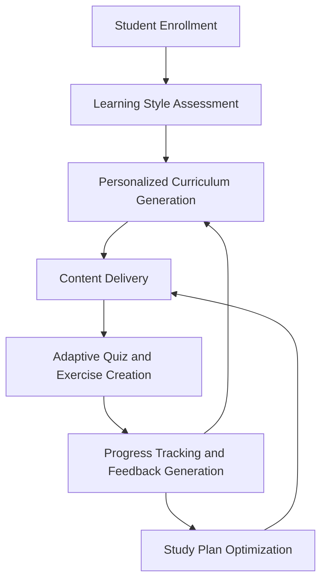
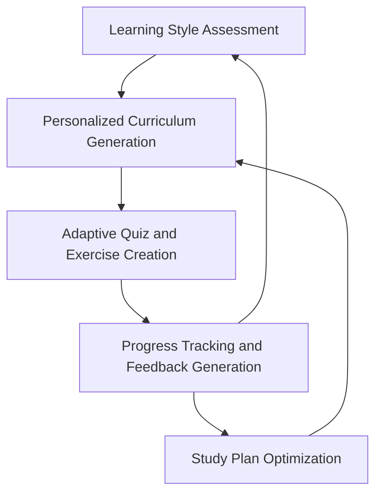

# Personalized Education and Tutoring System Analysis

## 1. System Overview

The Personalized Education and Tutoring System utilizes LLMs to provide tailored learning experiences for students. The system adapts to individual learning styles, generates personalized content, and offers adaptive assessments and feedback.

## 2. Sub-processes

1. Learning Style Assessment
2. Personalized Curriculum Generation
3. Adaptive Quiz and Exercise Creation
4. Progress Tracking and Feedback Generation
5. Study Plan Optimization

## 3. Detailed Sub-process Analysis

### 3.1 Learning Style Assessment

#### Input Schema
```json
{
  "student_id": "string",
  "questionnaire_responses": [
    {
      "question_id": "string",
      "response": "string"
    }
  ],
  "previous_performance": [
    {
      "subject": "string",
      "score": "number"
    }
  ],
  "learning_history": [
    {
      "activity_type": "string",
      "engagement_level": "number"
    }
  ]
}
```

#### Output Schema
```json
{
  "student_id": "string",
  "learning_style_profile": {
    "visual_score": "number",
    "auditory_score": "number",
    "kinesthetic_score": "number",
    "reading_writing_score": "number"
  },
  "preferred_content_types": ["string"],
  "recommended_teaching_methods": ["string"]
}
```

### 3.2 Personalized Curriculum Generation

#### Input Schema
```json
{
  "student_id": "string",
  "learning_style_profile": {
    "visual_score": "number",
    "auditory_score": "number",
    "kinesthetic_score": "number",
    "reading_writing_score": "number"
  },
  "subject": "string",
  "current_knowledge_level": "number",
  "learning_objectives": ["string"]
}
```

#### Output Schema
```json
{
  "student_id": "string",
  "personalized_curriculum": [
    {
      "topic": "string",
      "content_type": "string",
      "difficulty_level": "number",
      "estimated_duration": "number",
      "learning_resources": [
        {
          "resource_type": "string",
          "resource_url": "string"
        }
      ]
    }
  ],
  "curriculum_summary": "string"
}
```

## 4. Process Flow



## 5. Component Relationship Diagram



## 6. Pros and Cons Analysis

| Aspect | Pros | Cons |
|--------|------|------|
| LLM Modeling | - Natural language processing of student responses<br>- Generation of diverse, engaging content<br>- Personalized feedback and study plans | - Difficulty in ensuring factual accuracy<br>- Challenges in handling complex, multi-step problem-solving<br>- Potential biases in learning style assessment |
| Economic Modeling | - Clear metrics for student performance and engagement<br>- Potential for increased course completion rates<br>- Scalability of personalized education | - Long-term nature of educational outcomes<br>- Difficulty in isolating impact of AI vs. other factors<br>- Variability in effectiveness across subjects and student groups |

## 7. Key Performance Indicators (KPIs)

1. Student Engagement Rate
2. Average Improvement in Test Scores
3. Course Completion Rate
4. Student Satisfaction Score
5. Time to Achieve Learning Objectives
6. Adaptive Content Effectiveness (measured by post-content quiz performance)

## 8. Economic Impact Model

Let:
- E = Student engagement rate
- S = Average improvement in test scores
- C = Course completion rate
- T = Time to achieve learning objectives
- R = Revenue per completed course

Then, the Economic Impact (EI) can be modeled as:

EI = (E * S * C) * (R / T)

This model suggests that the economic impact increases with higher engagement, better test scores, and higher completion rates, while decreasing with longer learning times. The actual coefficients and relationship might be more complex and would need to be determined through data analysis.

